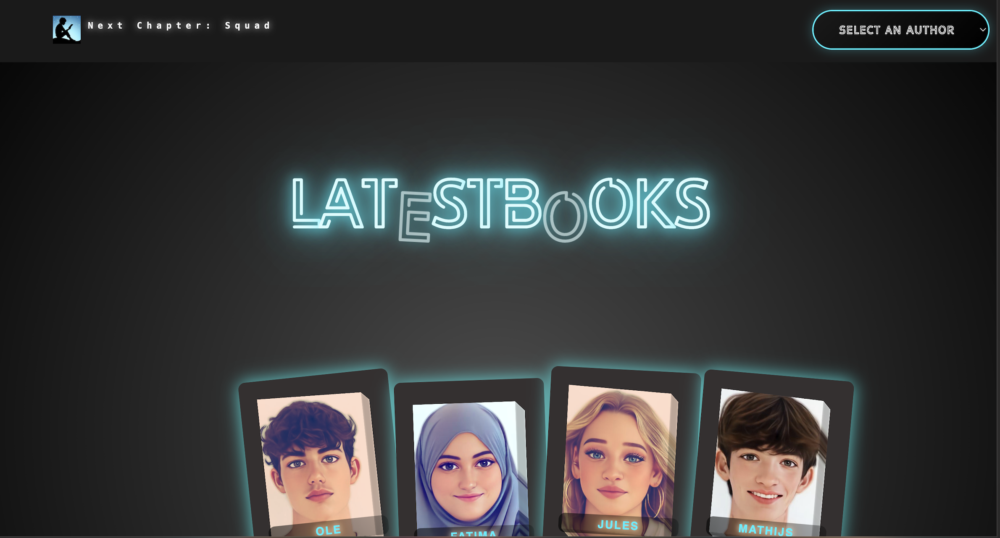

# Squad page

Ontwerp en maak met een team een website met NodeJS en JSON.

De instructie vind je in: [INSTRUCTIONS](https://github.com/fdnd-task/connect-your-tribe-squad-page/blob/main/docs/INSTRUCTIONS.md)

## Inhoudsopgave Squad page

  *[Beschrijving](#beschrijving)
  *[Kenmerken](#kenmerken)
  *[Installatie](#installatie)
  *[Gebruik](#gebruik)
  *[Bronnen](#bronnen)
  *[Licentie](#licentie)

## Beschrijving

Mijn project is een boekenwebsite. Op de homepage staat het logo, een headline, en aan het einde van de regel een "Search"-knop met de optie "Select a Genre".

Wanneer een gebruiker op deze knop klikt, verschijnt een lijst met boekgenres. Zodra een gebruiker een genre selecteert (bijvoorbeeld Thriller), worden de boeken binnen dat genre gefilterd en opgehaald via de API. De genres en bijbehorende boeken zijn vooraf geselecteerd en gefilterd door eerstejaarsstudenten van de opleiding.

In de body van de website is een neon-effect toegepast rondom de "Latest Books"-header. Hiervoor heb ik CSS-animaties gebruikt om een speels en dynamisch design te creëren.

Daaronder verschijnen telkens vier boeken, die op basis van afbeeldingen van een paar eerstejaarsstudenten  die  bewerkt zijn.

link :
https://connect-your-tribe-squad-page-so6s.onrender.com/

image :

## Kenmerken

HTML Structuur
Semantische structuur met header, main, section, footer.
Dynamische rendering met Liquid Templates % render % voor herbruikbare componenten.
Dropdown voor genre-selectie select element.
Modal-venster (div class="modal") voor het tonen van gebruikers.
Dynamische boekenlijst % for book in books % die boeken genereert vanuit een array.

CSS (Mobile-first met uitbreidingen voor desktop)
Keyframes-animaties voor neon-effecten.
Blur- en hover-effecten voor interactieve elementen.

JavaScript
API-aanroep (GET-request) om genres en boeken op te halen.
GSAP voor boekanimaties en hover-effecten.
Event Listeners voor dropdown en modal functionaliteit.

Extra Features
Neon-glow en blur-effecten in de UI voor een futuristische uitstraling.
Mobile-first design, daarna verbeterd voor desktop met media queries.

## Installatie

-De repository forken en de URL kopiëren.
-De repository klonen via de terminal: git clone: gekopieerde-URL
-De projectmap openen in VS Code via de terminal:cd repository-map
-Alle benodigde pakketten installeren met: npm install
-npm start:
-Bij een succesvolle start verschijnt het bericht:Application started on localhost:8000

## Gebruik

## Bronnen

The Liquid Template Language
stackoverflow.com
restack.io
gsap documentation
keyframes van een project

## Licentie

This project is licensed under the terms of the [MIT license](./LICENSE).
